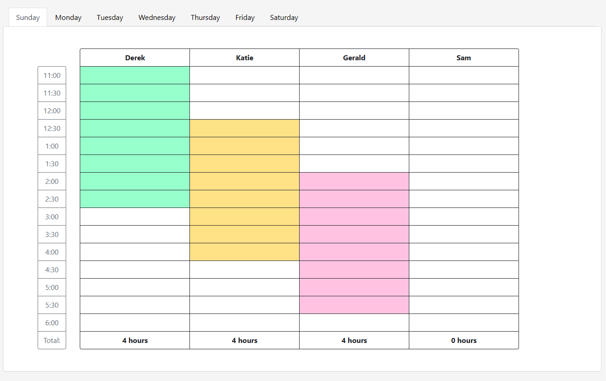

# Schedule Maker

Schedule Maker is an application designed to streamline the process of creating employee schedules. Add your employees and start creating a scheudle with a visually intuitive schedule matrix.

## Features

- **Employee Management:** Add new employees with detailed information including email, phone, etc.
- **Visual Schedule Matrix:** Click on a day of the week to view a dynamic matrix, visually representing employee schedules and shift overlaps.
- **Real-Time Updates:** The schedule automatically updates as you add people to each day, providing an up-to-date overview of the weekly schedule.

## Installation

To get Schedule Maker up and running on your local system, follow these steps:

1. **Clone the repository**

```
git clone https://github.com/yourusername/schedule-maker.git
cd schedule-maker
```

2. **Install Dependencies**

Assuming you have [Node.js](https://nodejs.org/) and [Angular CLI](https://angular.io/cli) installed, run:

```
npm install
```

3. **Serve the Application**

```
ng serve
```

After running `ng serve`, the app will be available at `http://localhost:4200/`. Open your browser and navigate to this address to start scheduling.

## Usage

1. **Start by clicking on a day of the week.** This opens up the schedule matrix for that day.
2. **Visualize the employee schedule.** The matrix allows you to see how each shift overlaps with others, making it easy to identify any scheduling conflicts or coverage gaps.
3. **Add employees to any day.** As you populate the day's schedule, the matrix updates in real-time to reflect changes.



_Example of the Schedule Matrix visualization._
